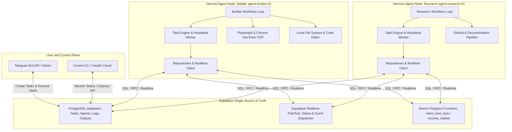
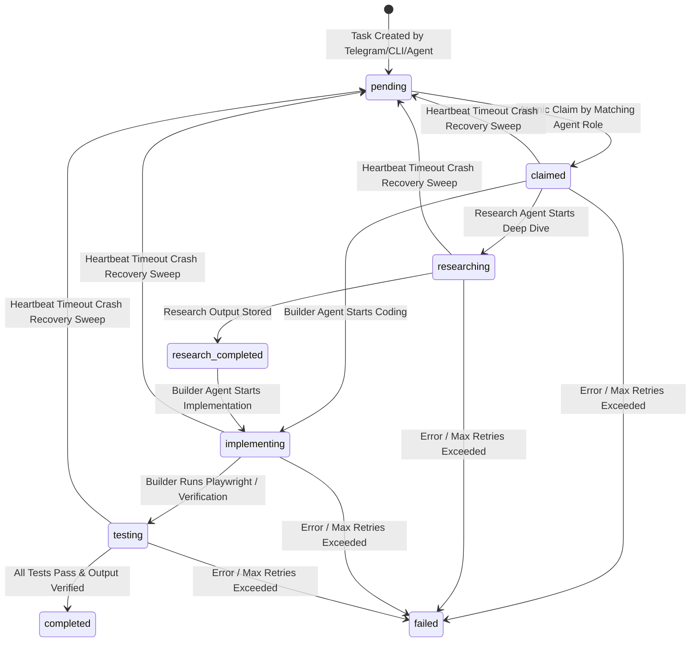

# Hermes V2 — Distributed Multi-Agent Operating System Architecture & Phase 1 Plan

Hermes V2 is a production-grade, distributed AI operating system where specialized, stateless AI agents collaborate asynchronously through a shared **Supabase** backend as their single source of truth and communication medium.

This document serves as the **Master Architectural Specification and Spec-Driven Implementation Plan**. It establishes the complete system boundaries, data model, state machines, design patterns, and exact step-by-step roadmap for all 8 development phases, starting with **Phase 1: Project Skeleton & Architecture**.

---

## User Review Required

> [!IMPORTANT]
> **Single Codebase & Modular Agent Runner Design**
> We are structuring Hermes V2 as a unified Node.js project (`d:\01_Projects\04-Vibe-Coding-Grade\Hermes Distributed Multi-Agent System PRD`). Any node in the distributed cluster runs the exact same codebase using role-based configuration flags (e.g., `node src/index.js --role=builder` or `--role=research`). This guarantees high cohesion, zero code duplication, and seamless addition of future roles (`QA`, `Designer`, `Vision`, `Security`, `DevOps`, `Planner`, `Analytics`) simply by registering a new role configuration and workflow module.

> [!IMPORTANT]
> **Database-Driven Concurrency & Atomic Claiming**
> To prevent race conditions where multiple agents claim the same task, all task claiming will use Postgres atomic row-locking (`SELECT ... FOR UPDATE SKIP LOCKED`) encapsulated within a Supabase Postgres function (`claim_next_task`).

---

## Open Questions

No blockers identified. The architecture and phase specifications below fully satisfy all requirements for high cohesion, low coupling, SOLID principles, Clean Architecture, and stateless agent workflows.

---

## System Architecture Overview



---

## Core Architectural Principles & Design Patterns

1. **Clean Architecture & Layered Boundaries**:
   - **Domain / Models (`src/models/`)**: Pure domain types, enums, and schema definitions. Zero external dependencies.
   - **Data / Repository Layer (`src/repositories/`)**: Implements Repository Pattern (`TaskRepository`, `AgentRepository`, `LogRepository`) over Supabase SDK. Agents never write raw SQL queries directly inside business logic.
   - **Core Engine (`src/core/`)**: Task execution state machine, heartbeat lifecycle, retry mechanism, and real-time event dispatcher.
   - **Services Layer (`src/services/`)**: External integrations (Telegram, Playwright, GitHub, LLM Orchestration).
   - **Agents Layer (`src/agents/`)**: Specialized role handlers inheriting from `BaseAgent`.

2. **SOLID & Dependency Injection**:
   - Dependencies (e.g., `SupabaseClient`, `TaskRepository`, `LogService`) are injected into Agent runners and Services at startup via a lightweight container or explicit factory pattern (`src/core/Container.js`).
   - Open/Closed Principle: Adding a new agent role requires adding `src/agents/roles/QAAgent.js` implementing `IAgentWorkflow`, without modifying `TaskEngine` or `BaseAgent`.

3. **Stateless Agents & Crash Recovery**:
   - Agents emit regular heartbeats (every 15 seconds) to `agent_heartbeats` and `agent_registry`.
   - If an agent crashes while a task is in `claimed`, `researching`, or `implementing`, the **Scheduler Sweep Service** detects a missed heartbeat (`now() - last_heartbeat > 45s`), increments `retry_count`, logs a recovery warning, and resets the task status to `pending` so another agent can claim it.

---

## Database Schema & Task Lifecycle State Machine

### 1. Task State Machine Transitions


### 2. Core Relational Schema (`schema.sql`)
- **`agent_registry`**: Tracks active agents (`agent_id`, `role`, `status`, `current_task_id`, `last_heartbeat`, `metadata`).
- **`tasks`**: Tracks all assignments (`id`, `title`, `description`, `required_role`, `status`, `priority`, `current_owner`, `parent_task_id`, `retry_count`, `max_retries`, `timeout_seconds`, `metadata`).
- **`task_outputs`**: Stores deliverables (`id`, `task_id`, `agent_id`, `output_type`, `content`, `artifacts`).
- **`agent_heartbeats`**: Telemetry (`agent_id`, `timestamp`, `cpu_usage`, `memory_usage`, `active_threads`, `status`).
- **`system_logs`**: Centralized structured audit trail (`id`, `timestamp`, `agent_id`, `task_id`, `severity`, `category`, `message`, `context`).

---

## Proposed Changes: Phase 1 (Project Skeleton & Architecture)

Phase 1 establishes the robust foundation of our single-codebase distributed operating system.

```
d:\01_Projects\04-Vibe-Coding-Grade\Hermes Distributed Multi-Agent System PRD\
├── package.json               # Node dependency definitions & scripts
├── .env.example               # Template for environment configuration
├── .gitignore                 # Git ignore patterns
├── eslint.config.js           # Production linting rules
├── src/
│   ├── index.js               # Main entrypoint CLI argument / environment role selector
│   ├── config/
│   │   ├── env.js             # Strict environment validation Zod schema
│   │   └── constants.js       # Centralized system constants & enums
│   ├── models/
│   │   ├── TaskStatus.js      # Enums for task states
│   │   ├── AgentRole.js       # Enums for agent roles
│   │   └── LogSeverity.js     # Enums for log levels
│   ├── utils/
│   │   ├── HermesError.js     # Custom structured error class
│   │   ├── logger.js          # Console + structured JSON logger wrapper
│   │   └── retry.js           # Exponential backoff utility
│   ├── core/
│   │   └── Container.js       # Dependency Injection container / registry
│   ├── repositories/          # Created in Phase 2
│   ├── services/              # Created in subsequent phases
│   ├── agents/                # Created in subsequent phases
│   └── database/
│       └── schema.sql         # Full production SQL schema & RPC functions
├── tests/
│   └── phase1/
│       └── skeleton.test.js   # Verification script for Phase 1 architecture & validation
└── README.md                  # Comprehensive architectural overview
```

### File Breakdown for Phase 1

#### [NEW] [package.json](file:///d:/01_Projects/04-Vibe-Coding-Grade/Hermes%20Distributed%20Multi-Agent%20System%20PRD/package.json)
Defines project dependencies (`@supabase/supabase-js`, `dotenv`, `zod`, `express`, `playwright`, `node-telegram-bot-api`, `winston`, `uuid`) and dev dependencies (`eslint`, `prettier`, `vitest` / `jest`), plus execution scripts (`start:builder`, `start:research`, `dev`, `lint`, `test`).

#### [NEW] [.env.example](file:///d:/01_Projects/04-Vibe-Coding-Grade/Hermes%20Distributed%20Multi-Agent%20System%20PRD/.env.example)
Clean template defining required variables: `SUPABASE_URL`, `SUPABASE_SERVICE_ROLE_KEY`, `TELEGRAM_BOT_TOKEN`, `AGENT_ID`, `AGENT_ROLE`, `HEARTBEAT_INTERVAL_MS`, `LOG_LEVEL`, `PORT`.

#### [NEW] [.gitignore](file:///d:/01_Projects/04-Vibe-Coding-Grade/Hermes%20Distributed%20Multi-Agent%20System%20PRD/.gitignore)
Standard Node.js and Playwright ignore rules (`node_modules`, `.env`, `test-results`, `logs`, `.gemini`).

#### [NEW] [src/config/constants.js](file:///d:/01_Projects/04-Vibe-Coding-Grade/Hermes%20Distributed%20Multi-Agent%20System%20PRD/src/config/constants.js)
Centralized constants: system timeouts, default retries, heartbeat frequencies, table names (`tasks`, `agent_registry`, `task_outputs`, `agent_heartbeats`, `system_logs`).

#### [NEW] [src/config/env.js](file:///d:/01_Projects/04-Vibe-Coding-Grade/Hermes%20Distributed%20Multi-Agent%20System%20PRD/src/config/env.js)
Strict environment variable loader and validator using `zod` to prevent startup if required configuration is missing or malformed.

#### [NEW] [src/models/TaskStatus.js](file:///d:/01_Projects/04-Vibe-Coding-Grade/Hermes%20Distributed%20Multi-Agent%20System%20PRD/src/models/TaskStatus.js)
Immutable object (`Object.freeze`) enumerating all task lifecycle states: `PENDING`, `CLAIMED`, `RESEARCHING`, `RESEARCH_COMPLETED`, `IMPLEMENTING`, `TESTING`, `COMPLETED`, `FAILED`.

#### [NEW] [src/models/AgentRole.js](file:///d:/01_Projects/04-Vibe-Coding-Grade/Hermes%20Distributed%20Multi-Agent%20System%20PRD/src/models/AgentRole.js)
Immutable object enumerating supported and future roles: `BUILDER`, `RESEARCH`, `QA`, `DESIGNER`, `VISION`, `SECURITY`, `DEVOPS`, `PLANNER`, `ANALYTICS`.

#### [NEW] [src/models/LogSeverity.js](file:///d:/01_Projects/04-Vibe-Coding-Grade/Hermes%20Distributed%20Multi-Agent%20System%20PRD/src/models/LogSeverity.js)
Log severity definitions: `DEBUG`, `INFO`, `WARN`, `ERROR`, `FATAL`.

#### [NEW] [src/utils/HermesError.js](file:///d:/01_Projects/04-Vibe-Coding-Grade/Hermes%20Distributed%20Multi-Agent%20System%20PRD/src/utils/HermesError.js)
Custom error class supporting structured context (`code`, `category`, `isRecoverable`, `metadata`) for precise error classification and automated retry decision logic.

#### [NEW] [src/utils/logger.js](file:///d:/01_Projects/04-Vibe-Coding-Grade/Hermes%20Distributed%20Multi-Agent%20System%20PRD/src/utils/logger.js)
Structured logger formatting messages with timestamps, agent IDs, and severity, ready to pipe to both stdout and Supabase `system_logs` table.

#### [NEW] [src/utils/retry.js](file:///d:/01_Projects/04-Vibe-Coding-Grade/Hermes%20Distributed%20Multi-Agent%20System%20PRD/src/utils/retry.js)
Configurable exponential backoff retry utility (`withRetry`) with jitter, designed to wrap network/database calls gracefully.

#### [NEW] [src/core/Container.js](file:///d:/01_Projects/04-Vibe-Coding-Grade/Hermes%20Distributed%20Multi-Agent%20System%20PRD/src/core/Container.js)
Simple dependency injection container that stores and resolves singleton instances (`config`, `logger`, repositories, services) across modular components.

#### [NEW] [src/database/schema.sql](file:///d:/01_Projects/04-Vibe-Coding-Grade/Hermes%20Distributed%20Multi-Agent%20System%20PRD/src/database/schema.sql)
Comprehensive PostgreSQL DDL script creating all 5 tables, indexes, updated_at triggers, and the atomic `claim_next_task` Postgres function using `SKIP LOCKED`.

#### [NEW] [src/index.js](file:///d:/01_Projects/04-Vibe-Coding-Grade/Hermes%20Distributed%20Multi-Agent%20System%20PRD/src/index.js)
Main application bootstrap. Parses command-line flags (`--role`, `--agent-id`), validates environment via `src/config/env.js`, registers dependencies in `Container`, and logs successful startup initialization.

#### [NEW] [tests/phase1/skeleton.test.js](file:///d:/01_Projects/04-Vibe-Coding-Grade/Hermes%20Distributed%20Multi-Agent%20System%20PRD/tests/phase1/skeleton.test.js)
Test script verifying that configuration validation correctly rejects invalid envs, custom errors format correctly, constants are immutable, and `Container` resolves registered modules.

#### [NEW] [README.md](file:///d:/01_Projects/04-Vibe-Coding-Grade/Hermes%20Distributed%20Multi-Agent%20System%20PRD/README.md)
Detailed documentation on Hermes V2 architecture, role capabilities, environment setup, and development workflow.

---

## Complete Phase-by-Phase Execution Roadmap (Phases 1 to 8)

| Phase | Milestone | Focus Areas | Deliverables |
| :--- | :--- | :--- | :--- |
| **Phase 1** | **Project Skeleton & Architecture** | Folder structure, config, DI container, domain enums, SQL DDL schema | `package.json`, `src/config/*`, `src/models/*`, `src/utils/*`, `src/core/Container.js`, `schema.sql` |
| **Phase 2** | **Supabase Integration** | Client wrapper, Repositories (`TaskRepository`, `AgentRepository`, `LogRepository`), Realtime pub/sub subscriptions | `src/database/client.js`, `src/repositories/*`, database helper methods, verification tests |
| **Phase 3** | **Task Engine** | Polling queue, atomic claiming, scheduler crash recovery sweep, heartbeat background worker, state transitions | `src/core/TaskEngine.js`, `src/core/HeartbeatWorker.js`, `src/core/SchedulerSweep.js` |
| **Phase 4** | **Telegram Integration** | Bot initialization, commands (`/status`, `/task`, `/agents`, `/kill`), notification broadcaster | `src/services/TelegramService.js`, `src/controllers/TelegramController.js` |
| **Phase 5** | **Research Agent** | Base agent contract, research workflow loop, GitHub API/Search hooks, documentation extraction & synthesis | `src/agents/BaseAgent.js`, `src/agents/roles/ResearchAgent.js`, `src/services/GitHubService.js` |
| **Phase 6** | **Builder Agent** | Realtime task listener, Playwright browser automation, CDP devtools, file system modifier, testing runner | `src/agents/roles/BuilderAgent.js`, `src/services/PlaywrightService.js`, `src/services/CodeEditorService.js` |
| **Phase 7** | **Logging & Monitoring** | Structured Supabase log sink, retry metrics tracking, automated error classification, recovery decorators | `src/services/LogService.js`, `src/utils/metrics.js` |
| **Phase 8** | **Production Polish** | Express health check endpoints (`/health`, `/metrics`), graceful shutdown handlers (`SIGINT/TERM`), deployment guides | `src/server.js`, `docs/DEPLOYMENT.md`, final system integration verification |

---

## Verification Plan for Phase 1

### Automated Verification
Run Node to test configuration and module compilation:
```powershell
node --check src/index.js
node --check src/config/env.js
node --check src/models/TaskStatus.js
node --check src/models/AgentRole.js
node --check src/models/LogSeverity.js
node --check src/utils/HermesError.js
node --check src/utils/logger.js
node --check src/utils/retry.js
node --check src/core/Container.js
```

Run test suite for Phase 1:
```powershell
node tests/phase1/skeleton.test.js
```

### Manual Verification
1. Inspect `src/database/schema.sql` to verify atomic claiming (`SKIP LOCKED`) and complete table structures.
2. Verify that running `node src/index.js --role=builder --agent-id=builder-01` with mock environment variables initializes cleanly without throwing unhandled errors.
